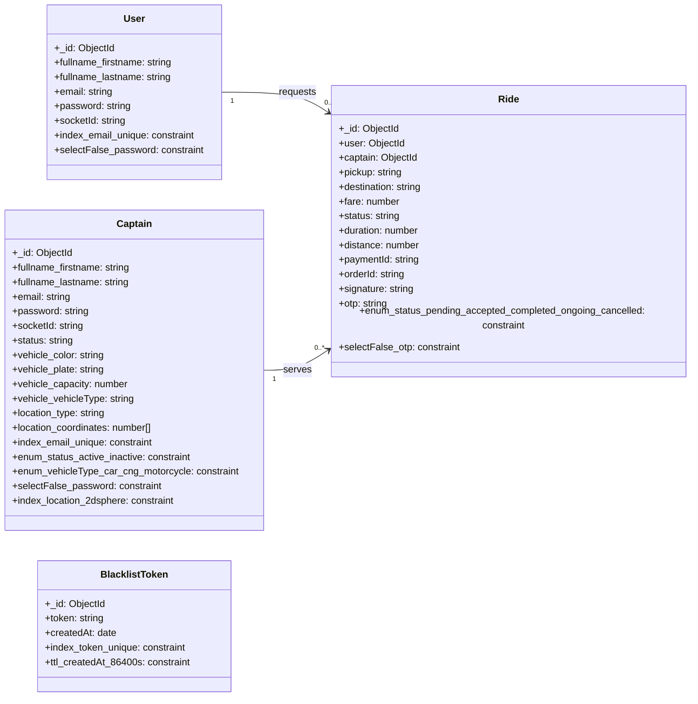

# ER Diagram for Ride Booking System

```mermaid
classDiagram
    direction LR
    
    class User {
        +_id: ObjectId
        +fullname_firstname: string
        +fullname_lastname: string
        +email: string
        +password: string
        +socketId: string
        +index_email_unique: constraint
        +selectFalse_password: constraint
    }
    
    class Captain {
        +_id: ObjectId
        +fullname_firstname: string
        +fullname_lastname: string
        +email: string
        +password: string
        +socketId: string
        +status: string
        +vehicle_color: string
        +vehicle_plate: string
        +vehicle_capacity: number
        +vehicle_vehicleType: string
        +location_type: string
        +location_coordinates: number[]
        +index_email_unique: constraint
        +enum_status_active_inactive: constraint
        +enum_vehicleType_car_cng_motorcycle: constraint
        +selectFalse_password: constraint
        +index_location_2dsphere: constraint
    }
    
    class Ride {
        +_id: ObjectId
        +user: ObjectId
        +captain: ObjectId
        +pickup: string
        +destination: string
        +fare: number
        +status: string
        +duration: number
        +distance: number
        +paymentId: string
        +orderId: string
        +signature: string
        +otp: string
        +enum_status_pending_accepted_completed_ongoing_cancelled: constraint
        +selectFalse_otp: constraint
    }
    
    class BlacklistToken {
        +_id: ObjectId
        +token: string
        +createdAt: date
        +index_token_unique: constraint
        +ttl_createdAt_86400s: constraint
    }
    
    User "1" --> "0..*" Ride : requests
    Captain "1" --> "0..*" Ride : serves
```